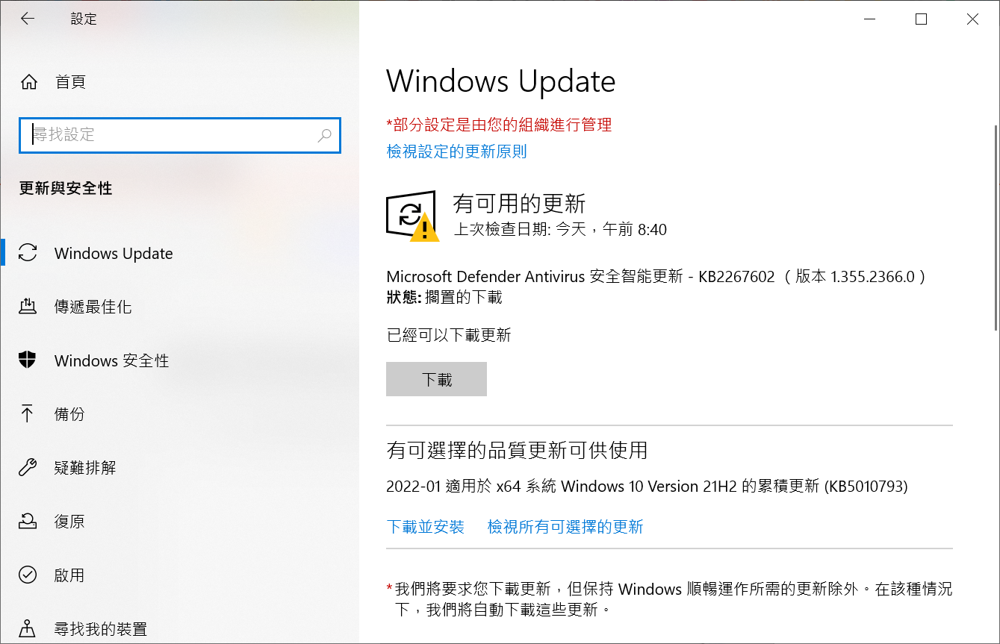
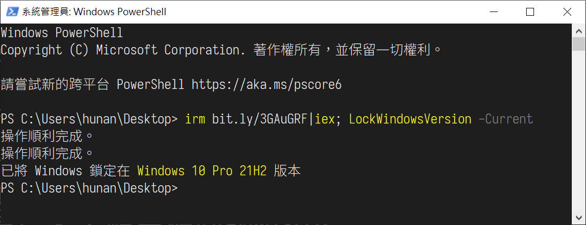

Windows更新相關設置
===

快速使用 (設定更新為手動)
```ps1
irm bit.ly/StopWinUpdate|iex; StopWinUpdate -Manual
```



<br><br><br>

## 設定 Windows 自動更新

```ps1
# 恢復預設值
irm bit.ly/StopWinUpdate|iex; StopWinUpdate -Default

# 設定更新為手動
irm bit.ly/StopWinUpdate|iex; StopWinUpdate -Manual

# 關閉自動更新
irm bit.ly/StopWinUpdate|iex; StopWinUpdate -Stop

```

<br><br><br>

## 刪除已下載的緩存
```PS1
irm bit.ly/StopWinUpdate|iex; Remove-WinUpdateStorage
```

> 點了但是反悔了不想安裝了，關機選單裡卡一個黃色驚嘆號要求可以用這個清掉
> (部分重啟要求是已經安裝完只是需要重啟, 這個刪掉也沒辦法反悔)

<br><br><br>

## 鎖定 Windows 版本


```ps1
# 鎖定當前 Windows 版本
irm bit.ly/StopWinUpdate|iex; LockWindowsVersion -Current

# 指定 Windows 版本
irm bit.ly/StopWinUpdate|iex; LockWindowsVersion -Version:21H2

# 復原解鎖(之後想更新的話)
irm bit.ly/StopWinUpdate|iex; LockWindowsVersion -Unlock

```
