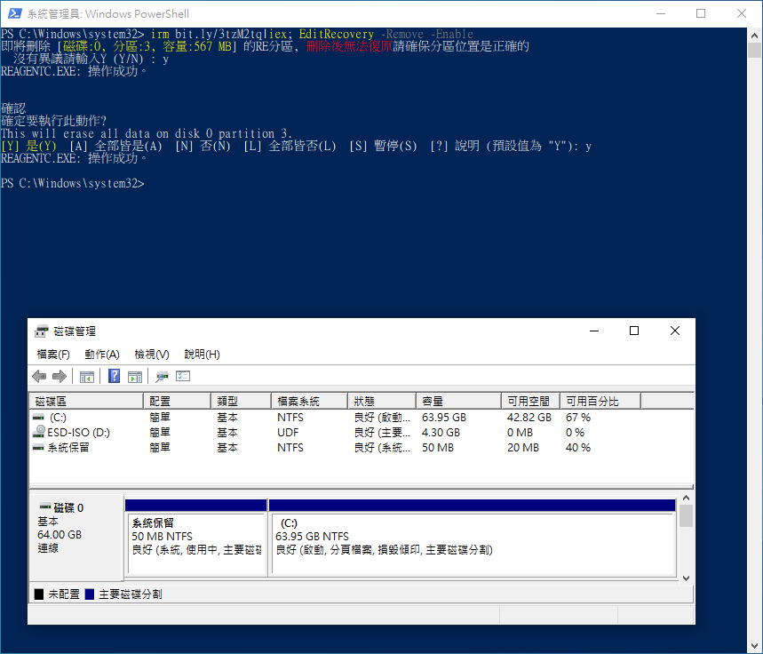

RE修復系統編輯工具
===



### 快速使用
移除硬碟上的分區並自動合併剩餘空間到前一個磁碟區。

```ps1
irm bit.ly/EditRecovery|iex; EditRecovery -Remove
```

## 其他命令
```ps1
# 查看當前狀態
EditRecovery -Info

# 移除 Recovery 分區
EditRecovery -Remove

# 移除 Recovery 分區並關閉 RE 系統
EditRecovery -Remove -Disable

# 啟用 RE系統
EditRecovery -Enable
# 關閉 RE系統
EditRecovery -Disable

# 重設 Winre.wim 檔案
EditRecovery -SetReImg
# 重設 Winre.wim 檔案，並重新指定檔案
EditRecovery -SetReImg -ImgPath:"D:\ImgPath"
```