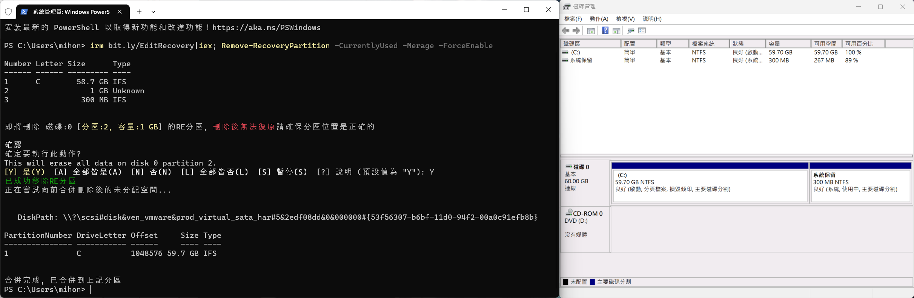

WindwosRE系統 - 修復分區編輯工具
===



## 快速使用

刪除當前系統使用中的RE分區
```ps1
irm bit.ly/EditRecovery|iex; Remove-RecoveryPartition -CurrentlyUsed -Merage -ForceEnable
```

刪除所有RE分區
```ps1
irm bit.ly/EditRecovery|iex; (Get-RecoveryPartition -S C) |ForEach {
    $_|Remove-RecoveryPartition -Merage
}
```

建立RE新區
```ps1
irm bit.ly/EditRecovery|iex; New-RecoveryPartition -RestartRecovery
```

重啟RE系統
```ps1
Reagentc -Disable |Out-Null; Reagentc -Enable |Out-Null; Reagentc /Info
```


<br><br><br>

## Remove-RecoveryPartition
移除RE分區

- -Partition  
要移除的指定Partition物件
- -CurrentlyUsed  
選定當前系統使用中的RE分區移除
- -Merage  
移除完RE分區後自動將未分配空間合併到前方分區
- -ForceEnable  
如果RE系統沒有啟用則嘗試啟用 (若RE系統未啟用無法獲取分區)

<br>

## New-RecoveryPartition
新增RE分區

- -Size  
新增的分區大小，預設是1024MB
- -CompressDriveLetter  
從哪個分區壓縮，預設是C槽
- -RestartRecovery  
新增完是否重新啟動RE分區
