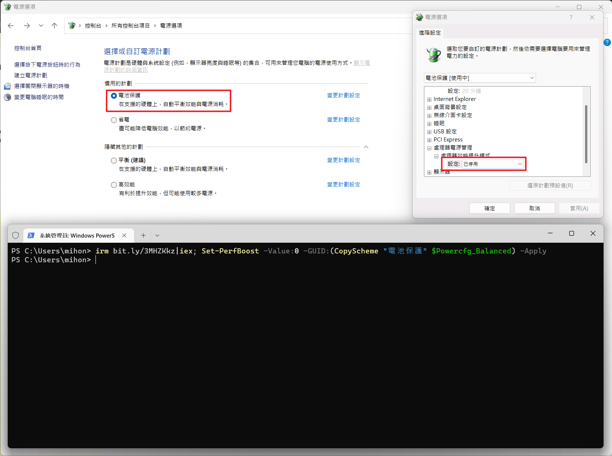

筆電降溫，關閉CPU自動超頻
===



關閉當前方案的自動超頻
```ps1
irm bit.ly/3MHZKkz|iex; Set-PerfBoost 0 -Apply
```

複製當前方案並關閉自超頻
```ps1
irm bit.ly/3MHZKkz|iex; Set-PerfBoost 0 (CopyScheme "電池保護") -Apply
```

複製預設方案並關閉自超頻
```ps1
irm bit.ly/3MHZKkz|iex; Set-PerfBoost -Value:0 -GUID:(CopyScheme "電池保護" $Powercfg_PowerSaver) -Apply
irm bit.ly/3MHZKkz|iex; Set-PerfBoost -Value:0 -GUID:(CopyScheme "電池保護" $Powercfg_Balanced) -Apply
irm bit.ly/3MHZKkz|iex; Set-PerfBoost -Value:0 -GUID:(CopyScheme "電池保護" $Powercfg_HighPerformance) -Apply
```
