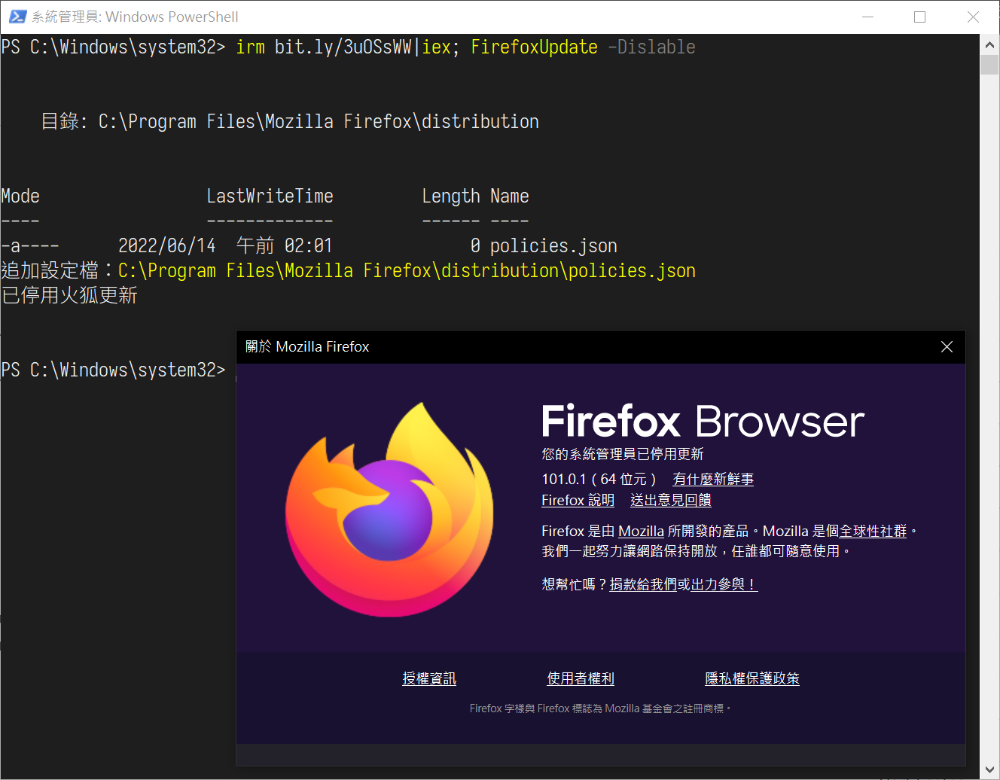

# 火狐停用更新



## 安裝版
```ps1
# 停用更新
irm bit.ly/3uOSsWW|iex; FirefoxUpdate -Dislable

# 恢復更新
irm bit.ly/3uOSsWW|iex; FirefoxUpdate -Enable
```

## 免安裝版
路徑自行取代

```ps1
# 停用更新
irm bit.ly/3uOSsWW|iex; FirefoxUpdate -Dislable -FirfoxPath:"C:\Program Files\Mozilla Firefox"

# 恢復更新
irm bit.ly/3uOSsWW|iex; FirefoxUpdate -Enable -FirfoxPath:"C:\Program Files\Mozilla Firefox"
```