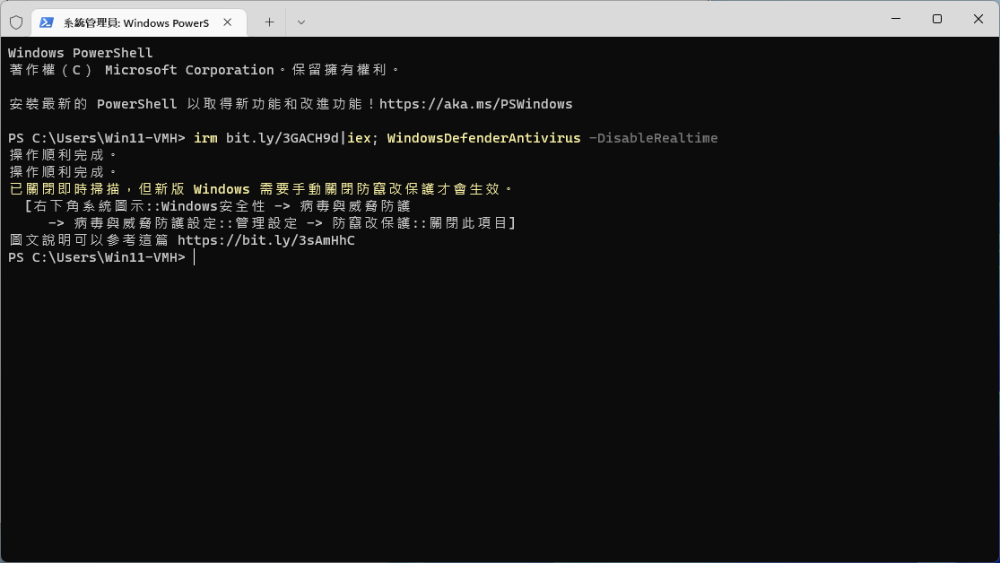

關閉WindowsDefenderAntivirus
===

快速使用(關閉即時掃描)
```ps1
irm bit.ly/SetWinDA|iex; WindowsDefenderAntivirus -DisableRealtime
```

執行完記得依照說明手動關閉防竄改保護 (參照文末有圖文說明)



<br>

詳細說明
```ps1
# 完整關閉 WindowsDefender (僅限專業版以上, 且須重新啟動電腦才會生效)
irm bit.ly/SetWinDA|iex; WindowsDefenderAntivirus -Disable

# 關閉即時掃描 (基本上就能避免 1. 砍你檔案 2. 阻擋執行非安全軟體)
irm bit.ly/SetWinDA|iex; WindowsDefenderAntivirus -DisableRealtime

# 恢復預設
irm bit.ly/SetWinDA|iex; WindowsDefenderAntivirus
```

> 已知家用版無法完整關閉 WindowsDefender 會被強制恢復  
> 家用版請選擇關閉即時掃描執行就好，至少這個是能關閉的  


<br><br><br>

## 關閉防竄改保護的設置方法
1. 程序執行完會自動打開WindowsDefenderAntivirus
(如果不小心關掉了照著說明重新點出來就好)

2. 依照圖片操作將防竄改保護關閉

